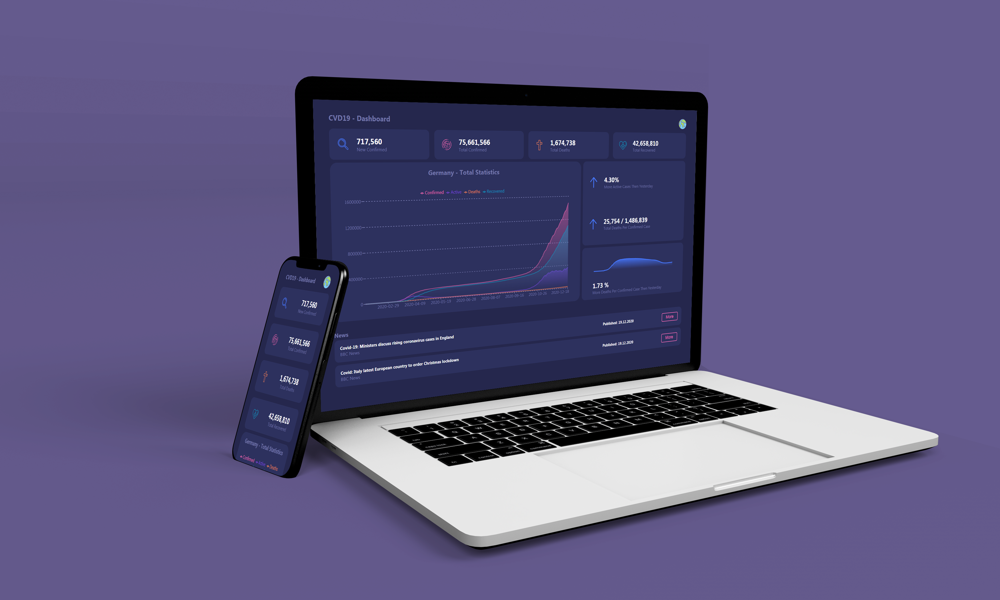

# CVD19-Dashboard  

### Important Covid-19 information in one place.

## About CVD19-Dashboard
This React web app shows you the latest global information about the Covid-19 pandemic. As well as important case information about selected countries. 
In addition, it shows the latest headlines about Covid-19. 
Finally it displays these informations in a visual appealing way to easily understand the data. 

Using Googles Firebase Hosting as well as heroku allows for a stable user experience

## Test It

Check out the dashboard and select your country on the top right: https://cvd-dashboard.web.app/
 
(Please allow for the heroku server to start up if he fell asleep)
